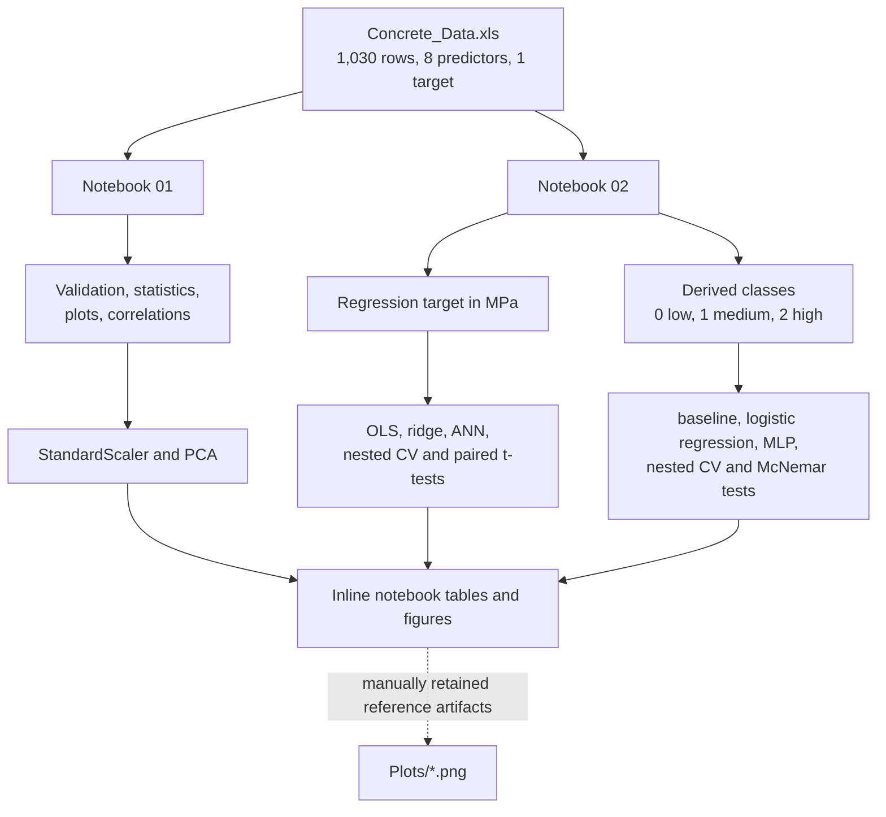

# 02452 Machine Learning Project — Fall 2025

Exploratory data analysis, principal component analysis, regression, and multiclass classification of the Concrete Compressive Strength dataset for DTU course 02452 Machine Learning.

## Contents

- [Overview](#overview)
- [How It Works](#how-it-works)
- [Architecture](#architecture)
- [Repository Structure](#repository-structure)
- [Requirements](#requirements)
- [Installation](#installation)
- [Configuration](#configuration)
- [Running the Notebooks](#running-the-notebooks)
- [Typical Workflow](#typical-workflow)
- [Inputs and Outputs](#inputs-and-outputs)
- [Dependencies](#dependencies)
- [Error Handling and Logging](#error-handling-and-logging)
- [Troubleshooting](#troubleshooting)
- [Development](#development)
- [Limitations](#limitations)
- [Security and Data Handling](#security-and-data-handling)
- [Related Documentation](#related-documentation)

## Overview

This repository contains two executed Jupyter notebooks built around the Concrete Compressive Strength dataset described in `Concrete_Readme.txt`. The eight numeric predictors describe a concrete mixture and its age. The target is laboratory-measured compressive strength in MPa.

The notebooks cover two stages of the coursework:

1. Inspect the dataset, calculate descriptive statistics, visualize the predictors, standardize the feature matrix, and perform principal component analysis (PCA).
2. Treat compressive strength first as a continuous regression target and then as a derived three-class classification target. Compare baselines, linear models, and ANNs using cross-validation and statistical tests.

## How It Works



Both notebooks load `Concrete_Data.xls` directly from the process working directory. They can be opened independently, but each notebook must be evaluated from top to bottom because later cells consume variables and fitted estimators created earlier.

## Architecture

| Component | Responsibility | Important relationships |
| --- | --- | --- |
| `01-ml-assignment-data-feature-extraction-and-visualization.ipynb` | Exploratory analysis and PCA | Reads the dataset, separates `X` and `y`, cleans feature labels for display, standardizes `X`, fits PCA, and renders inline output. |
| `02-ml-assignment-supervised-learning-classification-and-regression.ipynb` | Regression and classification experiments | Reads the same dataset independently; later cells reuse `X`, `y`, fold results, predictions, and selected hyperparameters from earlier cells. |
| `Concrete_Data.xls` | Primary input | Read by `pandas.read_excel()` in both notebooks. The file is never modified by notebook code. |
| `Concrete_Readme.txt` | Dataset provenance and schema reference | Records the source, units, row/attribute counts, literature references, and reuse notice. It is not parsed by the notebooks. |
| `Plots/` | Tracked reference figures | Contains retained PNG analysis artifacts. No active notebook cell calls `savefig()`, so their exact export provenance cannot be reconstructed and rerunning a notebook does not update them. |
| Notebook output cells | Persistent analysis state | Tables, text, and rendered plots are embedded in the `.ipynb` files when the notebooks are saved. No separate report is generated. |

There is no shared Python package between the notebooks and no persistent model state. The second notebook rebuilds every model in memory during execution.

## Repository Structure

```text
02452-machine-learning-project-fall-2025/
├── 01-ml-assignment-data-feature-extraction-and-visualization.ipynb
├── 02-ml-assignment-supervised-learning-classification-and-regression.ipynb
├── Concrete_Data.xls
├── Concrete_Readme.txt
├── Plots/
│   ├── ANN Training Loss per Outer Fold.png
│   ├── Boxplots.png
│   ├── Correlation Matrix.png
│   ├── Generalization Error vs λ.png
│   ├── Held-Out Test Set RMSE Comparison.png
│   ├── Histograms.png
│   ├── PCA Cumulative Variance.png
│   ├── PCA Projection.png
│   ├── PCA Scree Plot.png
│   └── ...
├── .gitignore
├── configuration.md
├── requirements.txt
└── README.md
```

The abbreviated `Plots/` listing shows representative artifacts; the directory also contains correlation, missing-value, PCA-loading, statistical-comparison, and summary-table images.

## Requirements

### Platform and editor

- Use Windows with Git, a Python installation that provides the `py` launcher, Visual Studio Code, the Microsoft Python extension, and the Microsoft Jupyter extension for the documented setup.
- The Jupyter extension provides the notebook interface; `requirements.txt` supplies the Python kernel/runtime packages but does not declare JupyterLab or the classic Notebook server.
- Windows is the only environment evidenced by the saved dependency snapshot. Other operating systems may require a revised dependency set and independent validation; they are not documented as supported.

### Verified runtime context

- The notebooks were saved with a kernel named `ml_project` whose metadata reports Python `3.11.9`.
- `requirements.txt` is a pinned snapshot of that Python environment except for `statsmodels`, which is unpinned.
- The complete requirements snapshot includes `pywin32==311`, so installing it unchanged is Windows-specific. The notebook source itself does not contain an explicit Windows-only path or API, but that is not evidence of validated support elsewhere.
- `Concrete_Data.xls` must be readable from the repository root. The legacy `.xls` format is handled through the declared `xlrd` dependency.
- No account, API key, database, external executable, or network connection is used while executing the analysis. Network access is normally needed only to clone the repository and install packages.

The nested searches in notebook 02 are CPU-intensive. Grid searches use `n_jobs=-1`, which asks joblib/scikit-learn to use all available processors. No GPU code is implemented, and the repository does not state a minimum CPU, memory, or run-time requirement.

## Installation

Use Visual Studio Code on Windows. Install the Microsoft **Python** and **Jupyter** extensions before opening the notebooks.

1. In a VS Code integrated terminal, clone the repository and create its environment:

```console
git clone https://github.com/chrisd314/02452-machine-learning-project-fall-2025.git
cd 02452-machine-learning-project-fall-2025
py -m venv .venv
```

2. Open this repository folder in VS Code. Run **Python: Select Interpreter** from the Command Palette and choose `.venv\Scripts\python.exe`.
3. Open a new integrated terminal after selecting the interpreter, then install the recorded environment:

```console
python -m pip install --upgrade pip
python -m pip install -r requirements.txt
```

4. Open a notebook, use **Select Kernel** in the notebook toolbar, choose **Python Environments**, and select the same `.venv` interpreter. The committed `ml_project` kernel name is metadata only; it does not create that environment automatically.

No manual activation command is needed in this workflow. The selected VS Code interpreter/kernel keeps package installation and notebook execution aligned.

## Configuration

There are no environment variables, `.env` files, command-line options, or external credentials. Configuration consists of:

- keeping `Concrete_Data.xls` at the relative path hard-coded in both notebooks;
- selecting an environment containing the declared packages;
- changing notebook constants directly when intentionally running a different experiment.

See [configuration.md](configuration.md) for the exact dataset schema, hyperparameter grids, class boundaries, working-directory behavior, and preflight checklist.

## Running the Notebooks

1. Open the repository root in VS Code with the Python and Jupyter extensions enabled.
2. Open `01-ml-assignment-data-feature-extraction-and-visualization.ipynb`.
3. Confirm the notebook kernel is the repository’s `.venv`, then run all cells in order.
4. Open `02-ml-assignment-supervised-learning-classification-and-regression.ipynb`, select the same kernel, and run all cells in order.

Notebook 01 performs the lightweight inspection and PCA stage. Notebook 02 performs repeated model fitting and can take substantially longer because it contains nested grid searches. Progress for the outer folds is printed in the notebook output; there is no progress file or background worker.

Rerunning either notebook updates in-memory values and displayed cell output only. Saving the notebook persists those outputs inside the `.ipynb` file. It does not update `Plots/`, export a spreadsheet, or serialize a fitted model.

## Typical Workflow

```text
1. Clone the repository and create the Python environment
2. Confirm Concrete_Data.xls is present in the repository root
3. Run notebook 01 from top to bottom and review validation, plots, and PCA
4. Run notebook 02 from top to bottom and monitor the nested-CV fold output
5. Review regression metrics and paired comparisons
6. Review class distribution, classification error, and McNemar comparisons
7. Save the notebooks only if the refreshed embedded outputs should be retained
```

Notebook 02 does not require notebook 01 to have been run: it loads the dataset and creates its own `X` and `y` variables.

## Inputs and Outputs

### Dataset schema

| Column role | Field | Unit |
| --- | --- | --- |
| Predictor | Cement | kg per m³ mixture |
| Predictor | Blast Furnace Slag | kg per m³ mixture |
| Predictor | Fly Ash | kg per m³ mixture |
| Predictor | Water | kg per m³ mixture |
| Predictor | Superplasticizer | kg per m³ mixture |
| Predictor | Coarse Aggregate | kg per m³ mixture |
| Predictor | Fine Aggregate | kg per m³ mixture |
| Predictor | Age | days |
| Target | Concrete compressive strength | MPa |

The implementation addresses the target by its exact workbook header, including a trailing space. Renaming or trimming that column in the workbook will break both notebooks unless their lookup expressions are updated too.

### Artifact lifecycle

| Artifact | Creator | Consumer | Format and location | Commit guidance |
| --- | --- | --- | --- | --- |
| `Concrete_Data.xls` | Dataset provider; tracked with the project | Both notebooks | Excel 97–2003 workbook in the repository root | Keep tracked with its attribution unless repository policy changes. |
| `Concrete_Readme.txt` | Dataset provider | Developers and reviewers | Plain text in the repository root | Keep tracked with the dataset. |
| Notebook cell outputs | Notebook execution | Notebook readers | Embedded JSON, text, HTML, and base64 image payloads inside each `.ipynb` | Review diffs before committing; outputs can be large and environment-dependent. |
| `Plots/*.png` | Retained coursework artifacts; generation is not automated in current cells | Report readers | PNG files in `Plots/` | Commit only deliberate figure updates. Rerunning does not refresh them. |
| Trained estimators and CV results | Notebook execution | Later cells in the same live kernel | Memory only | Nothing is written or committed automatically. |

## Dependencies

`requirements.txt` records a full environment rather than only direct imports. The packages central to the implementation are:

| Dependency | Use |
| --- | --- |
| `pandas` and `xlrd` | Read the `.xls` dataset and build result/summary tables. |
| `numpy` | Array operations, class creation, error calculations, and parameter ranges. |
| `matplotlib` and `seaborn` | Inline statistical and model-comparison visualizations. |
| `scikit-learn` | Scaling, PCA, splits, cross-validation, grid search, regression, classification, pipelines, and metrics. |
| `scipy` | Paired t-tests and confidence-interval quantiles for regression comparisons. |
| `statsmodels` | Exact McNemar tests for classification comparisons. |
| `ipykernel` and IPython stack | Execute and render notebook cells in a compatible frontend. |
| `joblib` and `threadpoolctl` | Parallel execution used internally by scikit-learn when `n_jobs=-1`. |

`openpyxl` is present in the snapshot but is not used to load the legacy `.xls` input in the active notebook code. Many other entries are transitive dependencies of the plotting, notebook, and scikit-learn stack.

## Error Handling and Logging

The notebooks do not configure a log file and do not wrap data loading or model fitting in application-level exception handlers. Errors appear in the failing cell and stop that execution path.

Notable behavior:

- A missing/unreadable dataset or changed target header raises from pandas or the explicit column lookup.
- Notebook 02 suppresses `ConvergenceWarning`, `UserWarning`, and `FutureWarning` globally. A fit may therefore complete without surfacing warnings that would otherwise help diagnose convergence or API changes.
- Invalid fold counts, empty classes, insufficient memory, or worker failures propagate from scikit-learn.
- The first notebook’s saved output contains a warning associated with adding a colorbar across different Matplotlib figures; it does not have custom recovery logic.
- No retry, checkpoint, resume, or partial-result export is implemented. Interrupting notebook 02 requires rerunning the affected cells.

## Troubleshooting

| Problem | Likely cause | Resolution |
| --- | --- | --- |
| `FileNotFoundError` for `Concrete_Data.xls` | The notebook server’s working directory is not the repository root, or the file was moved. | Start the frontend from the repository root and verify the filename and capitalization. |
| `KeyError` for the compressive-strength column | The workbook header was edited; the code expects its exact original text, including trailing whitespace. | Restore the tracked dataset or update the lookup consistently in both notebooks for an intentional schema change. |
| Pandas reports that it cannot determine or use an Excel engine | `xlrd` is missing or the selected environment differs from `requirements.txt`. | Select `.venv\Scripts\python.exe` in VS Code, open a new integrated terminal, and install the recorded requirements. |
| Import errors when opening a notebook | The selected kernel is not the environment where requirements were installed. | Select the `.venv` interpreter/kernel and restart the notebook kernel. |
| Installation on another operating system fails at `pywin32` | The committed snapshot is Windows-oriented, and that platform is outside the validated workflow. | Use the documented Windows/VS Code setup or prepare and independently validate a platform-specific dependency set; none is supplied here. |
| Notebook 02 runs for a long time or saturates the machine | Nested searches fit many candidates and use all processors through `n_jobs=-1`. | Allow the cell to finish, or deliberately reduce the documented grids/fold counts in a separate experiment. |
| A later cell reports an undefined variable | Cells were run out of order or the kernel was restarted. | Restart the kernel and run the notebook from the first cell. |
| Results differ after changing constants | Hyperparameter grids, folds, thresholds, or random seeds were changed. | Compare against [configuration.md](configuration.md) and restart/run all cells to remove stale state. |
| A plot in `Plots/` does not match fresh notebook output | PNG export is not automated. | Treat the notebook as current runtime output and update the static artifact deliberately if required. |

## Development

There is no package build, test suite, formatter/linter configuration, Dockerfile, PyInstaller specification, or CI workflow in this repository.

For a reliable notebook change:

1. Create a clean environment from `requirements.txt` with the documented Windows/VS Code setup.
2. Restart the kernel and run all cells in order.
3. Check that both notebooks still load the tracked dataset and complete without cell errors.
4. Review notebook diffs for unintended output churn or local paths.
5. Update a `Plots/` artifact only when intentionally exporting a corresponding figure; no code synchronizes it.

Because notebook 02 is expensive, syntax-only or partial-cell checks are not equivalent to a complete validation run.

## Limitations

- The work is an analysis artifact, not a reusable training or inference library.
- Model objects, scalers, predictions, and CV tables exist only in the active kernel and are not serialized.
- The data path and experiment settings are hard-coded in notebook cells.
- Notebook 02’s nested searches are computationally expensive and have no checkpoint/resume mechanism.
- Globally suppressed warnings can conceal convergence and compatibility information.
- The class labels are project-defined from a continuous target: `< 25.01` is class `0`, `>= 25.01` and `< 55.02` is class `1`, and `>= 55.02` is class `2`. These boundaries are not read from dataset metadata.
- The final logistic-regression pipeline is fitted on the full dataset before the final 80/20 split is evaluated. Consequently, the printed final accuracy and classification report are not an independent held-out estimate; the nested out-of-fold results are the stronger evaluation in the existing implementation.
- The regression subset described in notebook output as held out is evaluated in multiple Part A/Part B cells, and all observations also participate in the separate full-data outer cross-validation. It should not be interpreted as a single untouched final test set.
- Static PNGs are not reproducibly generated by a script and can drift from notebook output.
- Python compatibility outside the saved Python 3.11.9 environment and non-Windows installation of the complete requirements snapshot are not documented or tested by repository automation.

## Security and Data Handling

The current code contains no credentials, tokens, authentication, network calls, or secret configuration. Still:

- Preserve the attribution and reuse notice in [Concrete_Readme.txt](Concrete_Readme.txt) when redistributing the dataset.
- Notebook outputs can capture local paths, exception details, and data samples. Inspect and, when appropriate, clear outputs before publishing notebooks run on another machine or with another dataset.
- Do not substitute confidential data without first reviewing the embedded-output and Git-history implications.
- Virtual environments are excluded by `.gitignore`; do not commit local kernels, caches, or unrelated data exports.

## Related Documentation

- [Configuration reference](configuration.md)
- [Dataset description, attribution, and reuse notice](Concrete_Readme.txt)
- [Exploratory analysis and PCA notebook](01-ml-assignment-data-feature-extraction-and-visualization.ipynb)
- [Supervised learning notebook](02-ml-assignment-supervised-learning-classification-and-regression.ipynb)
